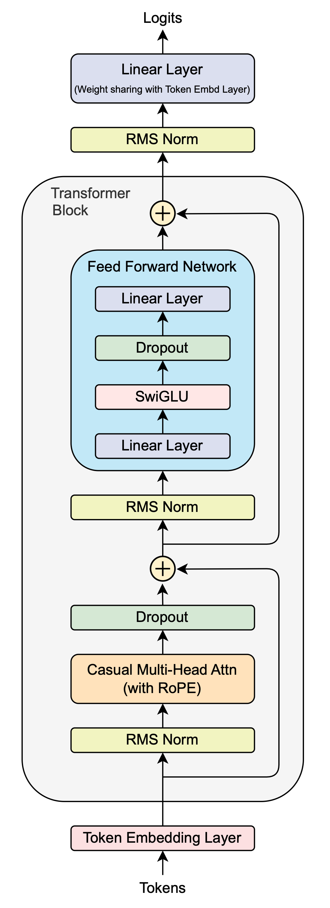
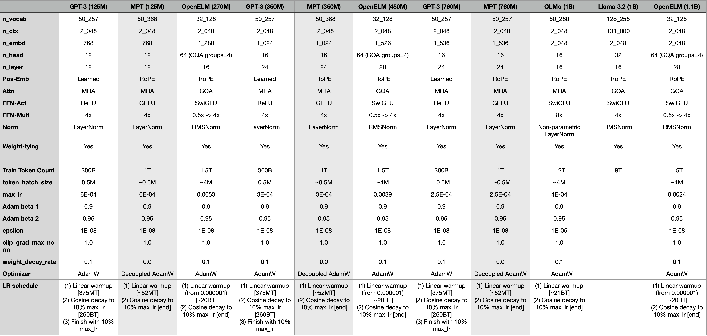
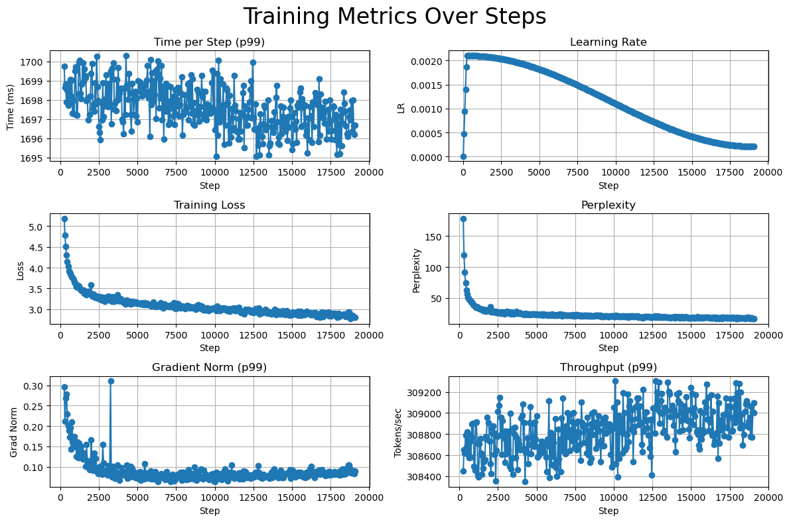
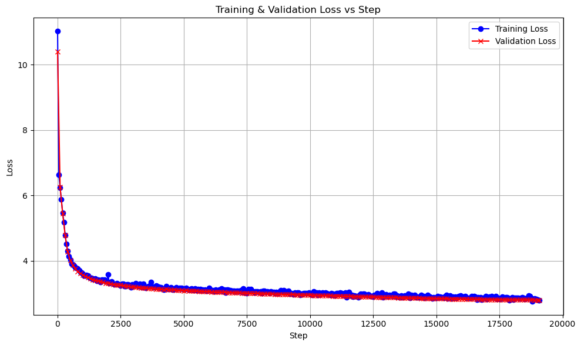
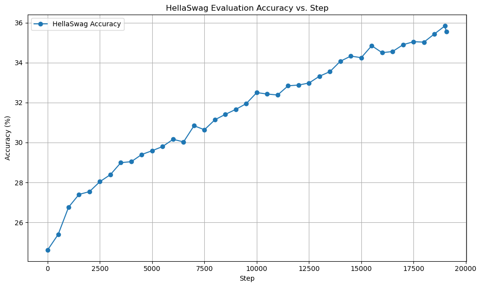

# LF_LLM-269M

MyLLM is a deep-learning personal project where I built a modern LLM (`LF_LLM-269M`) from the ground up. I focused on developing the core components required for pre-training an LLM, including writing the model-architecture code, handling large datasets, training the model efficiently, and evaluating its performance.

Below I'll talk about the structure of this project, design choices, training, and results. You can find the pretrained model on Huggingface ([LF_LLM-269M on Huggingface 🤗](https://huggingface.co/LF-Luis/LF_LLM-269M)).

# Directory Structure
Directory structure of various components implemented to build `LF_LLM-269M`.

<table>

<thead> <tr> <th> Component </th> <th> Code </th> </tr> </thead>

<tbody>

<tr> <td> <b> Model Code </b>  
Literal code for building every  
layer of the model, and notebook  
used to figure some of this.
</td> <td> <pre>
└── src
    ├── <a href="./src/model.py">model.py</a>
    ├── <a href="./src/global_cache.py">global_cache.py</a>
    ├── <a href="./src/transformer_block.py">transformer_block.py</a>
    ├── <a href="./src/attention.py">attention.py</a>
    ├── <a href="./src/rope.py">rope.py</a>
    ├── <a href="./src/ffn.py">ffn.py</a>
    └── notebooks
        └── <a href="./notebooks/notes.ipynb">notes.ipynb</a>
</pre> </td> </tr>

<tr> <td> <b> Model Config </b>  
Config data type, actual and debug 
configs, and helper notebook used 
to figure out config values.
</td> <td> <pre>
└── src
    ├── <a href="./src/params.py">params.py</a>
    ├── model_configs
        └── <a href="./src/model_configs/my_llm_config.py">my_llm_config.py</a>
    └── notebooks
        └── <a href="./notebooks/parameters_tuning.ipynb">parameters_tuning.ipynb</a>
</pre> </td> </tr>

<tr> <td> <b> Model Training </b>  
Code to pretrain model, compute  
validation loss, scheduled AdamW  
wrapper, weight initialization  
scheme, and distributed training handler.
</td> <td> <pre>
└── src
    ├── <a href="./pretrain.py">pretrain.py</a>
    ├── model_assessment
        └── <a href="./src/model_assessment/validation.py">validation.py</a>
    ├── model_utils
        ├── <a href="./src/model_utils/adamw_opt.py">adamw_opt.py</a>
        └── <a href="./src/model_utils/weight_init.py">weight_init.py</a>
    └── utils
        └── <a href="./src/utils/handle_ddp.py">handle_ddp.py</a>
</pre> </td> </tr>

<tr> <td> <b> Training Data </b>  
Code to download, tokenize, and 
shard 10 Billion Tokens (BT) 
worth of training data. And 
also randomly shuffle and 
load shards to memory while 
running distributed training.
</td> <td> <pre>
└── src
    ├── data_processing
        ├── <a href="./src/data_processing/data_downloader.py">data_downloader.py</a>
        └── <a href="./src/data_processing/training_data_loader.py">training_data_loader.py</a>
    └── utils
        └── <a href="./src/utils/rand_idx_seq_gen.py">rand_idx_seq_gen.py</a>
</pre> </td> </tr>

<tr> <td> <b> Model Assessment </b>  
Code to autoregressively sample 
from the LF_LLM-269M model and 
run HellaSwag evaluation.
</td> <td> <pre>
└── src
    └── model_assessment
        ├── <a href="./src/model_assessment/sampling.py">sampling.py</a>
        └── <a href="./src/model_assessment/hellaswag.py">hellaswag.py</a>
</pre> </td> </tr>

<tr> <td> <b> Training Helpers </b>  
Helper code to log, manage files, 
checkpoint, and graph metrics.
</td> <td> <pre>
└── src
    ├── utils
        ├── <a href="./src/utils/logger.py">logger.py</a>
        └── <a href="./src/utils/root.py">root.py</a>
    ├── model_utils
        ├── <a href="./src/model_utils/debugging.py">debugging.py</a>
        └── <a href="./src/model_utils/checkpoint_utils.py">checkpoint_utils.py</a>
    └── notebooks
        └── <a href="./notebooks/metric_graphs.ipynb">metric_graphs.ipynb</a>
</pre> </td> </tr>

<tr> <td> <b> Temp Storage </b>  
Temp storage where datasets, 
logs, checkpoints are stored 
for easy access as model is 
being trained/evaluated.
</td> <td> <pre>
└── temp_data/*
</pre> </td> </tr>

</tbody> </table>

# How To Reproduce
You can debug training on a Mac (or most unix/linux-machine) by using `./run_pre_training_e2e_debug.sh`.   

To actually train the model I used NVIDIA GPUs (went with 8xA100s because of cost). To run training end-to-end (downloading all datasets needed, training, running evals, etc) you can simply run `./run_pre_training_e2e.sh`. I used [VESSL AI's](https://vessl.ai) Workspaces to setup my training infra, using their `PyTorch 2.3.1 (CUDA 12.1)` image.

[hf_sampling.ipynb](./notebooks/hf_sampling.ipynb) has steps to download the model (`LF_LLM-269M`) from Huggingface and sample it (see the long text response example in there about the *The Industrial Revolution* and *Climate change*).

# LF_LLM-269M

### Model Architecture
I went with the following model architecture, inspired by examples seen in GPT-2/3, Llama 3.2, OpenELM, MolmoE, OLMo, etc.

From the bottom up on the diagram below, I used OpenAI's fast `tiktoken` library and leveraged their `r50k_base` BPE tokenizer, which has a vocab size of 50,257 —- sufficient for the small model I aimed to pre-train. As is common now, I went with pre-layer normalization, using RMSNorm due to its efficiency (compared to LayerNorm) while still providing stable normalization for the small training dataset and model.  

In the Transformer Block, I used regular causal multi-head attention (powered by PyTorch's `F.scaled_dot_product_attention`, which, according to my setup, should have been using `FlashAttention2`). There was no clear advantage to using GQA or other variants for this small model. Instead of using fixed or learned positional embeddings, I implemented RoPE to conserve model capacity (i.e., not something else the model has to optimize) and maintain the model's contextual understanding capacity (keeping the window size at 2,048). I applied a small dropout after this to avoid overfitting in the learned representations of the attention mechanism. With more data and a deeper model, I wouldn't have used dropout, but here the opposite was true.  

In the Feed Forward Network, I opted for SwiGLU, as it has become very popular with modern LLMs due to its efficiency and improved expressiveness through its gating mechanism. I added another small dropout after the activation because, at that point, the hidden state has quadrupled in size, and I wanted to avoid overfitting given the limited training data (relative to production LLMs, i.e., mine: 10BT vs. theirs: 1–9TT or larger). I effectively wanted to force the model to learn redundant representations that come out of the activation layer.

As is common, I added residual connections from the start of a Transformer Block to after the attention mechanism, and then from there to the end of that Transformer Block. This gives the deep model a fighting chance by allowing deeper layers to learn useful representations due to improved gradient flow.

After the data passes through various Transformer Blocks, the model ends with another RMS Normalization layer and, finally, a learned Linear Layer (with no bias). The Linear Layer at the end shares weights with the Token Embedding Layer located at the start of the model. This is done to reduce the model size while also acting as a regularization and generalization technique.
        

### Model and Training Parameters
Due to my limited GPU resources (I don't want to spend resources searching for the best parameters), and because this is a learning project, I'll base my parameters around the parameters used by open source LLMs. It's not a perfect approach by any means, and choosing parameters can be an entire project of its own, but for now this is fine.   

Below is a summary table I created to help me tune my parameters (more info in [parameters_tuning.ipynb](./notebooks/parameters_tuning.ipynb)).

For `LF_LLM-269M`, I chose the following parameters. See [my_llm_config.py](./src/model_configs/my_llm_config.py) for all configs.

| Parameter | Value |
|-----------|-------|
| n_vocab     |   50_257   |
| n_ctx     |   2_048   |
| n_embd     |   1_024   |
| n_head     |   16   |
| n_layer     |   16   |
| Pos-Emb     | RoPE     |
| Attn      |  MHA    |
| FFN-Act     |   SwiGLU   |
| FFN-Mult     |   4x   |
| Norm     |   RMSNorm   |
| Weight-tying     |  Yes    |
|   |        |
| Train Token Count     |  10B    |
| token_batch_size     |   ~0.5M   |
| max_lr     |  0.0021    |
| Adam beta 1     |   0.9   |
| Adam beta 2     |   0.95   |
| epsilon     |  1e-8    |
| clip_grad_max_norm     |  1.0    |
| weight_decay_rate     |   0.1   |
| Optimizer     |  AdamW    |
| LR schedule     |   (1) Linear warmup for 119 Million Tokens (MT)  (2) Cosine decay to 10% max_lr until end |

### Pre-Training Data
For pre-training data I looked at [Dolma](https://allenai.org/dolma) and [RedPajama-v2](https://www.together.ai/blog/redpajama-data-v2), but [build-nanogpt](https://github.com/karpathy/build-nanogpt) showed me that a smaller, more refined dataset is enough for a small project like this so I ended up using the [Fineweb-Edu (sample-10BT)](https://huggingface.co/datasets/HuggingFaceFW/fineweb-edu) dataset.

# Training LF_LLM-269M

Training was done on 8 rented NVIDIA-A100-SXM4-80GB, hosted on [VESSL AI's](https://vessl.ai), I used their `PyTorch 2.3.1 (CUDA 12.1)` image for this project.   

The model trained on the 10 Billion Tokens (BT) of data for about 8 hours and 47 mins (from `20:28 2024-12-06 - 05:15 2024-12-07 UTC`). Each training step processed over 0.52 Million Tokens (MT) at around ~1698 ms (1.698 secs) per step. The throughput was around ~308,800 tokens processed per second. Fine detail of pretraining can be found in the logs: [pretraining_log.txt](./assets/pretraining_log.txt).

# Results

Compared to the table of open source models in Model and Training Parameters above where models are trained with trillions of tokens, `LF_LLM-269M` was trained with only 10 billion tokens (yes, different tokenizers, but it's a fair comparison). Even with this short training run, the results look pretty good.  

Both training and validation loss decreased with the same shape, showing that at a high level overfitting is not a major concern. Perplexity reached values of around 16.5, meaning the model is fairly confident in its predictions having narrowed down the choices effectively.   

The LR scheduler behaved as expected, the time per training step and throughput are consistent throughout the entire training loop, and gradient norm stayed fairly constant.

To get a better sense of the model's sentence completion capabilities, I ran some prompts before the model even trained (so total random noise) and after the model had completed training and it's showing that it's making some sense:

| 📝 Prompt         | ❌ Sentence Completion at Step 0 | ✅ Sentence Completion after Last Step |
|-------------------|----------------------------------------------|------------|
| "*HTML stands for*" | " *campaigns desserts sawradio AUTH sort Pythononto unforeseen rainfall rainfall Host awaits solubleheaded Fever estimate genders proponentMAR*" | " *HyperText Markup Language. For more information about the browser, see:<\|endoftext\|>A few months ago*" |
| "*If animals could talk, my pet would probably say*" | " *undertake undertake distortion intest Gylassotide acids Yankee neoconcept Coming Coming launcherimpl Sussex Sussexinea minim Ding*" | "*hello or I would say Hi. I am excited to have my pet respond to the sound I*" |
| "*The clever fox built the strange machine with just a feather, a pebble, and a tiny twig*" | " *intrusion complying Resist master Yad induced derogatory Magic damageced amusing 290Sn},{" muddy universal prospect prospect prospect Rey*" | "*; by the time it was ready, it was a great working machine. After watching him carefully,*" |

[hf_sampling.ipynb](./notebooks/hf_sampling.ipynb) has longer response examples.

<strong>Resources/References</strong>

- [Molomo (MolmoE)](https://huggingface.co/allenai/MolmoE-1B-0924)
- [apple/corenet](https://github.com/apple/corenet/tree/main)
- [allenai/OLMo](https://github.com/allenai/OLMo)
- [mosaicml/llm-foundry](https://github.com/mosaicml/llm-foundry)
- [google-research/tuning_playbook](https://github.com/google-research/tuning_playbook)
- [karpathy/build-nanogpt](https://github.com/karpathy/build-nanogpt/tree/master)
- more to add...

-----

### Why is the icon above a fox?
I asked ChatGPT for a mascot to represent this project, and it suggested a "puzzle fox." I'd never heard of that before, but it explained that it aligns with the project because various puzzle pieces were cleverly put together — clever like a fox 😅.

-----

## License
GNU GPLv3 ([LICENSE.txt](./LICENSE.txt))
